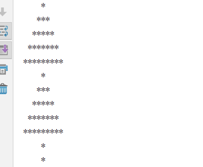

Smart Code
===
1 febonacci Number
------
* print 0 to 100 Array as below: 
* 0,1,1,2,3,5,8,13 ..... 
*  F(0)=1，F(1)=1, F(n)=F(n-1)+F(n-2)

2 print chris tree
------
 

3 calculate String "12b3rrr  yy5555ldfgjdflkjgdfgjdfij"
------
>calculate space("")
>calculate number(0 to 9) 
>calculate letter(a to z && A to Z)

------
4 input any 3 number and order by desc
> you can by bubble sort
> eg: intput 1,4,8  then print 8,4,1

 
